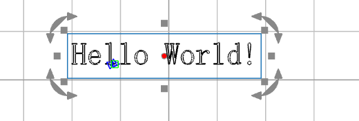
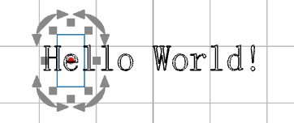
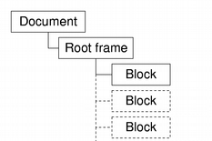
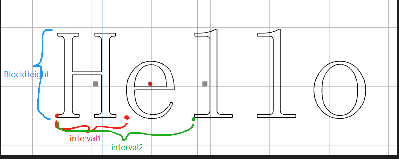

拆分前：


拆分后：


文字类的结构是：


文字：

```
void seperate(){
    float blockHeight = 0;
    // get format from qt document
    auto format = QTextCursor(docoument).charFormat();

    // block loop
    for (int j = 0; j < doc->blockCount(); j++) 
    {       
        QTextBlock block = doc->findBlockByNumber(j); // get current block
        QTextCursor textCursor(block); // get current cursor 
        QString context = block.text(); // get current context
        QTextLine line = block.layout()->lineAt(0); //get current line
        
        QList<QGlyphRun> glyphs;
        QVector<QVector<QPointF>> pos; // save each word position
        
        // loop of evey word in the block
        for (int i = 0; i < context.length(); i++)
        {
            glyphs.append(line.glyphRuns(i, 1));
            // get the interval from fisrt word to current word (img 3)
            auto interval = glyphs[i].positions(); 
            pos.push_back(interval); 

            auto new_item = new TextDocumentItem();
            QTextCursor new_cursor(new_item->get_document());

            // set new format 
            new_cursor.setBlockCharFormat(new_cursor.blockCharFormat());
            new_cursor.setCharFormat(textCursor.charFormat());

            // set current text
            new_cursor.insertText(QString{ context[i] });

            // new document position(orignal.x + pos[i][0].x(), orignal.y - blockHeight)

        }
        blockHeight += line.height();
    }
}
```
